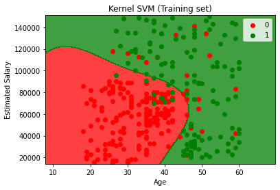
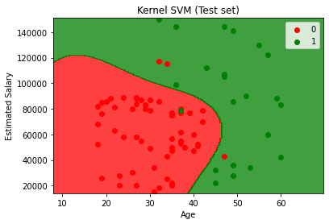

## Importing the libraries


```python
import pandas as pd
import numpy as np
import matplotlib.pyplot as plt
```

## Importing the Dataset


```python
df = pd.read_csv("Social_Network_Ads.csv")
X = df.iloc[:, :-1].values
y = df.iloc[:,-1].values
```

## Splitting the dataset into Training and Test dataset


```python
from sklearn.model_selection import train_test_split
X_train, X_test, y_train, y_test = train_test_split(X, y, test_size=0.2, random_state=0)
```

## Feature Scaling


```python
from sklearn.preprocessing import StandardScaler
sc = StandardScaler()
X_train = sc.fit_transform(X_train)
X_test = sc.transform(X_test)
```

## Training the Kernel SVM on the training set


```python
from sklearn.svm import SVC
classifier = SVC(kernel="rbf", random_state=0)
classifier.fit(X_train, y_train)
```


    SVC(random_state=0)


## Predicting a new result


```python
print(classifier.predict(sc.transform([[30,87000]])))
```

    [0]
    

## Predicting the Test set results


```python
y_pred = classifier.predict(X_test)
print(np.concatenate((y_pred.reshape(len(y_pred),1), y_test.reshape(len(y_test),1)),1))
```

    [[0 0]
     [0 0]
     [0 0]
     [0 0]
     [0 0]
     [0 0]
     [0 0]
     [1 1]
     [0 0]
     [1 0]
     [0 0]
     [0 0]
     [0 0]
     [0 0]
     [0 0]
     [1 0]
     [0 0]
     [0 0]
     [1 1]
     [0 0]
     [0 0]
     [1 1]
     [0 0]
     [1 1]
     [0 0]
     [1 1]
     [0 0]
     [0 0]
     [0 0]
     [0 0]
     [0 0]
     [0 1]
     [1 1]
     [0 0]
     [0 0]
     [0 0]
     [0 0]
     [0 0]
     [0 0]
     [1 1]
     [0 0]
     [0 0]
     [0 0]
     [0 0]
     [1 1]
     [0 0]
     [0 0]
     [1 1]
     [0 0]
     [1 1]
     [1 1]
     [0 0]
     [0 0]
     [1 0]
     [1 1]
     [1 1]
     [0 0]
     [0 0]
     [1 1]
     [0 0]
     [0 0]
     [1 1]
     [0 0]
     [1 1]
     [0 0]
     [1 1]
     [0 0]
     [0 0]
     [0 0]
     [0 0]
     [1 1]
     [0 0]
     [0 0]
     [1 1]
     [0 0]
     [0 0]
     [0 0]
     [0 0]
     [1 1]
     [1 1]]
    

## Making the Confusion Matrix


```python
from sklearn.metrics import confusion_matrix, accuracy_score
cm = confusion_matrix(y_test, y_pred)
print(cm)
accuracy_score(y_test, y_pred)
```

    [[55  3]
     [ 1 21]]
    


    0.95


## Visualising the Training set results


```python
from matplotlib.colors import ListedColormap
X_set, y_set = sc.inverse_transform(X_train), y_train
X1, X2 = np.meshgrid(np.arange(start = X_set[:, 0].min() - 10, stop = X_set[:, 0].max() + 10, step = 0.25),
                     np.arange(start = X_set[:, 1].min() - 1000, stop = X_set[:, 1].max() + 1000, step = 0.25))
plt.contourf(X1, X2, classifier.predict(sc.transform(np.array([X1.ravel(), X2.ravel()]).T)).reshape(X1.shape),
             alpha = 0.75, cmap = ListedColormap(('red', 'green')))
plt.xlim(X1.min(), X1.max())
plt.ylim(X2.min(), X2.max())
for i, j in enumerate(np.unique(y_set)):
    plt.scatter(X_set[y_set == j, 0], X_set[y_set == j, 1], c = ListedColormap(('red', 'green'))(i), label = j)
plt.title('Kernel SVM (Training set)')
plt.xlabel('Age')
plt.ylabel('Estimated Salary')
plt.legend()
plt.show()
```

    *c* argument looks like a single numeric RGB or RGBA sequence, which should be avoided as value-mapping will have precedence in case its length matches with *x* & *y*.  Please use the *color* keyword-argument or provide a 2D array with a single row if you intend to specify the same RGB or RGBA value for all points.
    *c* argument looks like a single numeric RGB or RGBA sequence, which should be avoided as value-mapping will have precedence in case its length matches with *x* & *y*.  Please use the *color* keyword-argument or provide a 2D array with a single row if you intend to specify the same RGB or RGBA value for all points.
    


    

    


## Visualising the Test set results


```python
from matplotlib.colors import ListedColormap
X_set, y_set = sc.inverse_transform(X_test), y_test
X1, X2 = np.meshgrid(np.arange(start = X_set[:, 0].min() - 10, stop = X_set[:, 0].max() + 10, step = 0.25),
                     np.arange(start = X_set[:, 1].min() - 1000, stop = X_set[:, 1].max() + 1000, step = 0.25))
plt.contourf(X1, X2, classifier.predict(sc.transform(np.array([X1.ravel(), X2.ravel()]).T)).reshape(X1.shape),
             alpha = 0.75, cmap = ListedColormap(('red', 'green')))
plt.xlim(X1.min(), X1.max())
plt.ylim(X2.min(), X2.max())
for i, j in enumerate(np.unique(y_set)):
    plt.scatter(X_set[y_set == j, 0], X_set[y_set == j, 1], c = ListedColormap(('red', 'green'))(i), label = j)
plt.title('Kernel SVM (Test set)')
plt.xlabel('Age')
plt.ylabel('Estimated Salary')
plt.legend()
plt.show()
```

    *c* argument looks like a single numeric RGB or RGBA sequence, which should be avoided as value-mapping will have precedence in case its length matches with *x* & *y*.  Please use the *color* keyword-argument or provide a 2D array with a single row if you intend to specify the same RGB or RGBA value for all points.
    *c* argument looks like a single numeric RGB or RGBA sequence, which should be avoided as value-mapping will have precedence in case its length matches with *x* & *y*.  Please use the *color* keyword-argument or provide a 2D array with a single row if you intend to specify the same RGB or RGBA value for all points.
    


    

    

