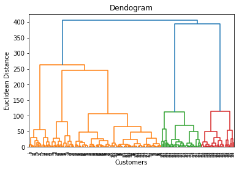
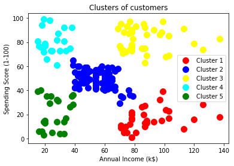

# Hierarchical Clustering

## Importing the libraries


```python
import pandas as pd
import numpy as np
from matplotlib import pyplot as plt
```

## Importing the dataset


```python
df = pd.read_csv("Mall_Customer.csv")
X = df.iloc[:, 3:].values
```

## Using the dendrogram to find the optimal number of clusters


```python
import scipy.cluster.hierarchy as sch
dendorgram = sch.dendrogram(sch.linkage(X, method = "ward"))
plt.title("Dendogram")
plt.xlabel("Customers")
plt.ylabel("Euclidean Distance")
plt.show()
```


    

    


## Training the Hierarchical Clustering model on the dataset


```python
from sklearn.cluster import AgglomerativeClustering
hc = AgglomerativeClustering(n_clusters=5, affinity="euclidean", linkage="ward")
y_hc = hc.fit_predict(X)
```

## Visualising the clusters


```python
plt.scatter(X[y_hc == 0, 0], X[y_hc == 0, 1], s = 100, c = "red", label = "Cluster 1")
plt.scatter(X[y_hc == 1, 0], X[y_hc == 1, 1], s = 100, c = "blue", label = "Cluster 2")
plt.scatter(X[y_hc == 2, 0], X[y_hc == 2, 1], s = 100, c = "yellow", label = "Cluster 3")
plt.scatter(X[y_hc == 3, 0], X[y_hc == 3, 1], s = 100, c = "cyan", label = "Cluster 4")
plt.scatter(X[y_hc == 4, 0], X[y_hc == 4, 1], s = 100, c = "green", label = "Cluster 5")
plt.title('Clusters of customers')
plt.xlabel('Annual Income (k$)')
plt.ylabel('Spending Score (1-100)')
plt.legend()
plt.show()
```


    

    

