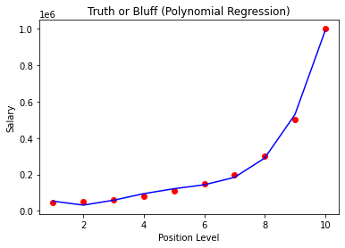

## Importing libraries


```python
import pandas as pd
import numpy as np
import matplotlib.pyplot as plt
```

## Importing dataset


```python
df = pd.read_csv("Salary_data.csv")
X = df.iloc[:,:-1].values
y = df.iloc[:,-1].values
```

## Splitting the dataset into training set and testing set


```python
from sklearn.model_selection import train_test_split
X_train, X_test, y_train, y_test = train_test_split(X,y,random_state=0)
```

## Testing the Simple Linear Regression model on the training set


```python
from sklearn.linear_model import LinearRegression
regressor = LinearRegression()
regressor.fit(X_train, y_train)
```


    LinearRegression()


## Predicting the Test set results


```python
y_pred = regressor.predict(X_test)
```

## Visualising the training set results


```python
plt.scatter(X_train, y_train, color = "red")
plt.plot(X_train, regressor.predict(X_train), color = "blue")
plt.title("Salary vs Years of Experience (Training set)")
plt.xlabel("Years of Experience")
plt.ylabel("Salary")
plt.show()
```


    

    


## Visualising the test set results


```python
plt.scatter(X_test, y_test, color = "red")
plt.plot(X_train, regressor.predict(X_train), color="blue")
plt.title("Salary vs Years of Experience (Test set)")
plt.xlabel("Years of Experience")
plt.ylabel("Salary")
plt.show()
```


    

    


```python

```
