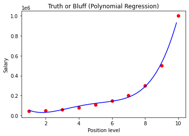

## Importing the libraries


```python
import pandas as pd
import numpy as np
import matplotlib.pyplot as plt
```

## Importing the dataset


```python
dataset = pd.read_csv('Position_Salaries.csv')
X = dataset.iloc[:, 1:-1].values
y = dataset.iloc[:, -1].values
```

## Training the linear regression model on the whole dataset


```python
from sklearn.linear_model import LinearRegression
lin_reg = LinearRegression()
lin_reg.fit(X, y)
```


    LinearRegression()


## Training the Polynomial Regression model on the whole dataset


```python
from sklearn.preprocessing import PolynomialFeatures
poly_reg = PolynomialFeatures(degree=4)
X_poly = poly_reg.fit_transform(X)
lin_reg_2 = LinearRegression()
lin_reg_2.fit(X_poly, y)
```


    LinearRegression()


## Visualising the Linear Regression results


```python
plt.scatter(X, y, color="red")
plt.plot(X, lin_reg.predict(X), color = "blue")
plt.title("Truth or Bluff (Linear Regression)")
plt.xlabel("Position Level")
plt.ylabel("Salary")
plt.show()
```


    

    


## Visualising the Polynomial Regression Results


```python
plt.scatter(X, y, color = "red")
plt.plot(X, lin_reg_2.predict(poly_reg.fit_transform(X)), color = "blue")
plt.title("Truth or Bluff (Polynomial Regression)")
plt.xlabel("Position Level")
plt.ylabel("Salary")
plt.show()
```


    

    


## Visualising the Polynomial Regression Results with higher resolution smoother curve


```python
X_grid = np.arange(min(X), max(X), 0.1)
X_grid = X_grid.reshape((len(X_grid), 1))
plt.scatter(X, y, color = 'red')
plt.plot(X_grid, lin_reg_2.predict(poly_reg.fit_transform(X_grid)), color = 'blue')
plt.title('Truth or Bluff (Polynomial Regression)')
plt.xlabel('Position level')
plt.ylabel('Salary')
plt.show()
```


    

    


## Predicting a new result with Linear Regression


```python
lin_reg.predict([[6.5]])
```


    array([330378.78787879])


## Predicting a new result with Polynomial Regression


```python
lin_reg_2.predict(poly_reg.fit_transform([[6.5]]))
```


    array([158862.45265157])


```python

```
