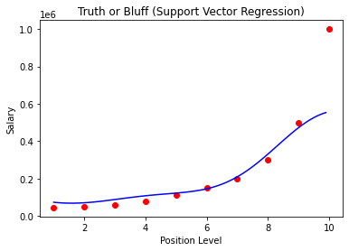

## Importing the libraries


```python
import pandas as pd
import numpy as np
import matplotlib.pyplot as plt
```

## Importing the Dataset


```python
df = pd.read_csv("Position_Salaries.csv")
X = df.iloc[:,1:-1].values
y = df.iloc[:,-1].values
```


```python
print(X)
```

    [[ 1]
     [ 2]
     [ 3]
     [ 4]
     [ 5]
     [ 6]
     [ 7]
     [ 8]
     [ 9]
     [10]]
    


```python
print(y)
```

    [  45000   50000   60000   80000  110000  150000  200000  300000  500000
     1000000]
    


```python
y = y.reshape(len(y),1)
```


```python
print(y)
```

    [[  45000]
     [  50000]
     [  60000]
     [  80000]
     [ 110000]
     [ 150000]
     [ 200000]
     [ 300000]
     [ 500000]
     [1000000]]
    

## Feature Scaling


```python
from sklearn.preprocessing import StandardScaler
sc_x = StandardScaler()
sc_y = StandardScaler()
X = sc_x.fit_transform(X)
y = sc_y.fit_transform(y)
```


```python
print(X)
```

    [[-1.5666989 ]
     [-1.21854359]
     [-0.87038828]
     [-0.52223297]
     [-0.17407766]
     [ 0.17407766]
     [ 0.52223297]
     [ 0.87038828]
     [ 1.21854359]
     [ 1.5666989 ]]
    


```python
print(y)
```

    [[-0.72004253]
     [-0.70243757]
     [-0.66722767]
     [-0.59680786]
     [-0.49117815]
     [-0.35033854]
     [-0.17428902]
     [ 0.17781001]
     [ 0.88200808]
     [ 2.64250325]]
    

## Training the SVR model on the whole Dataset


```python
from sklearn.svm import SVR
regressor = SVR(kernel = "rbf")
regressor.fit(X,y)
```

    C:\ProgramData\Anaconda3\lib\site-packages\sklearn\utils\validation.py:63: DataConversionWarning: A column-vector y was passed when a 1d array was expected. Please change the shape of y to (n_samples, ), for example using ravel().
      return f(*args, **kwargs)
    


    SVR()


## Predicting a new result


```python
sc_y.inverse_transform((regressor.predict(sc_x.transform([[6.5]]))))
```


    array([170370.0204065])


## Visualising the SVR results


```python
plt.scatter(sc_x.inverse_transform(X), sc_y.inverse_transform(y), color = "red")
plt.plot(sc_x.inverse_transform(X), sc_y.inverse_transform(regressor.predict(X)), color = "blue")
plt.title("Truth or bluff (Support Vector Regression)")
plt.xlabel("Position Level")
plt.ylabel("Salary")
plt.show()
```


    

    


## Visualising the SVR results (high resolution and smoother curve)


```python
X_grid = np.arange(min(sc_x.inverse_transform(X)), max(sc_x.inverse_transform(X)), 0.1)
X_grid = X_grid.reshape(len(X_grid),1)
plt.scatter(sc_x.inverse_transform(X), sc_y.inverse_transform(y), color = "red")
plt.plot(X_grid, sc_y.inverse_transform(regressor.predict(sc_x.transform(X_grid))), color = "blue")
plt.title("Truth or Bluff (Support Vector Regression)")
plt.xlabel("Position Level")
plt.ylabel("Salary")
plt.show()
```


    

    

