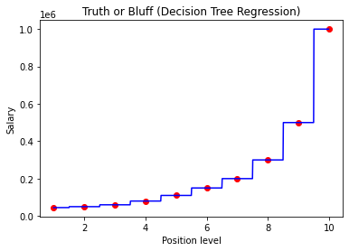

## Importing the libraries


```python
import pandas as pd
import numpy as np
import matplotlib.pyplot as plt
```

## Importing the Dataset


```python
df = pd.read_csv("Position_Salaries.csv")
X = df.iloc[:,1:-1].values
y = df.iloc[:,-1].values
```

## Training the Decision Tree Regression model on the whole dataset


```python
from sklearn.tree import DecisionTreeRegressor
regressor = DecisionTreeRegressor()
regressor.fit(X, y)
```


    DecisionTreeRegressor()


## Predicting a new result


```python
regressor.predict([[6.5]])
```


    array([150000.])


## Visualising the Decision Tree Regression results (higher resolution)


```python
X_grid = np.arange(min(X), max(X), 0.01)
X_grid = X_grid.reshape((len(X_grid), 1))
plt.scatter(X, y, color = "red")
plt.plot(X_grid, regressor.predict(X_grid), color = "Blue")
plt.title('Truth or Bluff (Decision Tree Regression)')
plt.xlabel('Position level')
plt.ylabel('Salary')
plt.show()
```


    

    


```python

```
