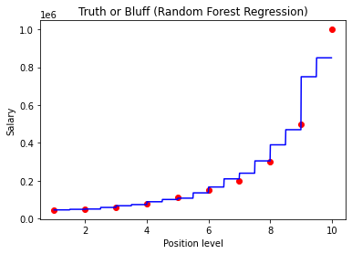

# Random Forest Regression

## Importing the libraries


```python
import numpy as np
import matplotlib.pyplot as plt
import pandas as pd
```

## Importing the dataset


```python
dataset = pd.read_csv('Position_Salaries.csv')
X = dataset.iloc[:, 1:-1].values
y = dataset.iloc[:, -1].values
```

## Training the Random Forest Regression model on the whole dataset


```python
from sklearn.ensemble import RandomForestRegressor
regressor = RandomForestRegressor(n_estimators = 10, random_state = 0)
regressor.fit(X, y)
```


    RandomForestRegressor(n_estimators=10, random_state=0)


## Predicting a new result


```python
regressor.predict([[6.5]])
```


    array([167000.])


## Visualising the Random Forest Regression results (higher resolution)


```python
X_grid = np.arange(min(X), max(X), 0.01)
X_grid = X_grid.reshape((len(X_grid), 1))
plt.scatter(X, y, color = 'red')
plt.plot(X_grid, regressor.predict(X_grid), color = 'blue')
plt.title('Truth or Bluff (Random Forest Regression)')
plt.xlabel('Position level')
plt.ylabel('Salary')
plt.show()
```


    

    

