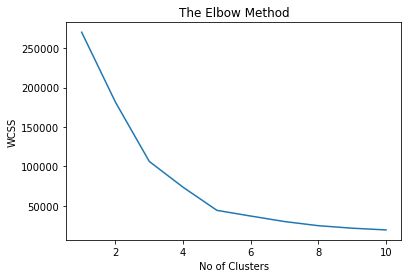
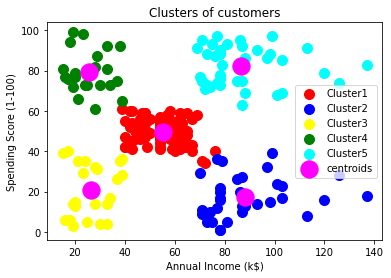

# Kmeans clustering


## Importing libraries


```python
import pandas as pd
import numpy as np
import matplotlib.pyplot as plt
```

## Importing the dataset


```python
df = pd.read_csv("Mall_customer.csv")
X = df.iloc[:,[3,4]].values
```

## Using Elbow method to find the optimal number of clusters


```python
from sklearn.cluster import KMeans
wcss = []
for i in range(1,11):
    kmeans = KMeans(n_clusters=i, init = "k-means++", random_state=42)
    kmeans.fit(X)
    wcss.append(kmeans.inertia_)
plt.plot(range(1,11),wcss)
plt.title("The Elbow Method")
plt.xlabel("No of Clusters")
plt.ylabel("WCSS")
plt.show()
```

    C:\ProgramData\Anaconda3\lib\site-packages\sklearn\cluster\_kmeans.py:881: UserWarning: KMeans is known to have a memory leak on Windows with MKL, when there are less chunks than available threads. You can avoid it by setting the environment variable OMP_NUM_THREADS=1.
      warnings.warn(
    


    

    


## Training Kmeans Model on the Dataset


```python
kmeans = KMeans(n_clusters=5, init="k-means++", random_state=42)
y_pred = kmeans.fit_predict(X)
print(y_pred)
```

    [2 3 2 3 2 3 2 3 2 3 2 3 2 3 2 3 2 3 2 3 2 3 2 3 2 3 2 3 2 3 2 3 2 3 2 3 2
     3 2 3 2 3 2 0 2 3 0 0 0 0 0 0 0 0 0 0 0 0 0 0 0 0 0 0 0 0 0 0 0 0 0 0 0 0
     0 0 0 0 0 0 0 0 0 0 0 0 0 0 0 0 0 0 0 0 0 0 0 0 0 0 0 0 0 0 0 0 0 0 0 0 0
     0 0 0 0 0 0 0 0 0 0 0 0 4 1 4 0 4 1 4 1 4 0 4 1 4 1 4 1 4 1 4 0 4 1 4 1 4
     1 4 1 4 1 4 1 4 1 4 1 4 1 4 1 4 1 4 1 4 1 4 1 4 1 4 1 4 1 4 1 4 1 4 1 4 1
     4 1 4 1 4 1 4 1 4 1 4 1 4 1 4]
    

##  Visualising the Kmeans Clustering


```python
plt.scatter(X[y_pred==0, 0], X[y_pred==0, 1], s=100, c="red", label = "Cluster1")
plt.scatter(X[y_pred==1, 0], X[y_pred==1, 1], s=100, c="blue", label = "Cluster2")
plt.scatter(X[y_pred==2, 0], X[y_pred==2, 1], s=100, c="yellow", label = "Cluster3")
plt.scatter(X[y_pred==3, 0], X[y_pred==3, 1], s=100, c="green", label = "Cluster4")
plt.scatter(X[y_pred==4, 0], X[y_pred==4, 1], s=100, c="cyan", label = "Cluster5")
plt.scatter(kmeans.cluster_centers_[:,0], kmeans.cluster_centers_[:,1], s=300, c="magenta", label="centroids")
plt.legend()
plt.title('Clusters of customers')
plt.xlabel('Annual Income (k$)')
plt.ylabel('Spending Score (1-100)')
plt.show()
```


    

    

