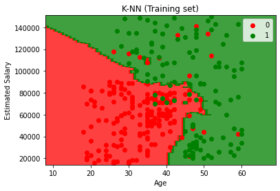
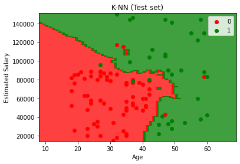

# Support Vector Machine (SVM)

## Importing the libraries


```python
import numpy as np
import matplotlib.pyplot as plt
import pandas as pd
```

## Importing the dataset


```python
dataset = pd.read_csv('Social_Network_Ads.csv')
X = dataset.iloc[:, :-1].values
y = dataset.iloc[:, -1].values
```

## Splitting the dataset into the Training set and Test set


```python
from sklearn.model_selection import train_test_split
X_train, X_test, y_train, y_test = train_test_split(X, y, test_size = 0.25, random_state = 0)
```


```python
print(X_train)
```

    [[    44  39000]
     [    32 120000]
     [    38  50000]
     [    32 135000]
     [    52  21000]
     [    53 104000]
     [    39  42000]
     [    38  61000]
     [    36  50000]
     [    36  63000]
     [    35  25000]
     [    35  50000]
     [    42  73000]
     [    47  49000]
     [    59  29000]
     [    49  65000]
     [    45 131000]
     [    31  89000]
     [    46  82000]
     [    47  51000]
     [    26  15000]
     [    60 102000]
     [    38 112000]
     [    40 107000]
     [    42  53000]
     [    35  59000]
     [    48  41000]
     [    48 134000]
     [    38 113000]
     [    29 148000]
     [    26  15000]
     [    60  42000]
     [    24  19000]
     [    42 149000]
     [    46  96000]
     [    28  59000]
     [    39  96000]
     [    28  89000]
     [    41  72000]
     [    45  26000]
     [    33  69000]
     [    20  82000]
     [    31  74000]
     [    42  80000]
     [    35  72000]
     [    33 149000]
     [    40  71000]
     [    51 146000]
     [    46  79000]
     [    35  75000]
     [    38  51000]
     [    36  75000]
     [    37  78000]
     [    38  61000]
     [    60 108000]
     [    20  82000]
     [    57  74000]
     [    42  65000]
     [    26  80000]
     [    46 117000]
     [    35  61000]
     [    21  68000]
     [    28  44000]
     [    41  87000]
     [    37  33000]
     [    27  90000]
     [    39  42000]
     [    28 123000]
     [    31 118000]
     [    25  87000]
     [    35  71000]
     [    37  70000]
     [    35  39000]
     [    47  23000]
     [    35 147000]
     [    48 138000]
     [    26  86000]
     [    25  79000]
     [    52 138000]
     [    51  23000]
     [    35  60000]
     [    33 113000]
     [    30 107000]
     [    48  33000]
     [    41  80000]
     [    48  96000]
     [    31  18000]
     [    31  71000]
     [    43 129000]
     [    59  76000]
     [    18  44000]
     [    36 118000]
     [    42  90000]
     [    47  30000]
     [    26  43000]
     [    40  78000]
     [    46  59000]
     [    59  42000]
     [    46  74000]
     [    35  91000]
     [    28  59000]
     [    40  57000]
     [    59 143000]
     [    57  26000]
     [    52  38000]
     [    47 113000]
     [    53 143000]
     [    35  27000]
     [    58 101000]
     [    45  45000]
     [    23  82000]
     [    46  23000]
     [    42  65000]
     [    28  84000]
     [    38  59000]
     [    26  84000]
     [    29  28000]
     [    37  71000]
     [    22  55000]
     [    48  35000]
     [    49  28000]
     [    38  65000]
     [    27  17000]
     [    46  28000]
     [    48 141000]
     [    26  17000]
     [    35  97000]
     [    39  59000]
     [    24  27000]
     [    32  18000]
     [    46  88000]
     [    35  58000]
     [    56  60000]
     [    47  34000]
     [    40  72000]
     [    32 100000]
     [    19  21000]
     [    25  90000]
     [    35  88000]
     [    28  32000]
     [    50  20000]
     [    40  59000]
     [    50  44000]
     [    35  72000]
     [    40 142000]
     [    46  32000]
     [    39  71000]
     [    20  74000]
     [    29  75000]
     [    31  76000]
     [    47  25000]
     [    40  61000]
     [    34 112000]
     [    38  80000]
     [    42  75000]
     [    47  47000]
     [    39  75000]
     [    19  25000]
     [    37  80000]
     [    36  60000]
     [    41  52000]
     [    36 125000]
     [    48  29000]
     [    36 126000]
     [    51 134000]
     [    27  57000]
     [    38  71000]
     [    39  61000]
     [    22  27000]
     [    33  60000]
     [    48  74000]
     [    58  23000]
     [    53  72000]
     [    32 117000]
     [    54  70000]
     [    30  80000]
     [    58  95000]
     [    26  52000]
     [    45  79000]
     [    24  55000]
     [    40  75000]
     [    33  28000]
     [    44 139000]
     [    22  18000]
     [    33  51000]
     [    43 133000]
     [    24  32000]
     [    46  22000]
     [    35  55000]
     [    54 104000]
     [    48 119000]
     [    35  53000]
     [    37 144000]
     [    23  66000]
     [    37 137000]
     [    31  58000]
     [    33  41000]
     [    45  22000]
     [    30  15000]
     [    19  19000]
     [    49  74000]
     [    39 122000]
     [    35  73000]
     [    39  71000]
     [    24  23000]
     [    41  72000]
     [    29  83000]
     [    54  26000]
     [    35  44000]
     [    37  75000]
     [    29  47000]
     [    31  68000]
     [    42  54000]
     [    30 135000]
     [    52 114000]
     [    50  36000]
     [    56 133000]
     [    29  61000]
     [    30  89000]
     [    26  16000]
     [    33  31000]
     [    41  72000]
     [    36  33000]
     [    55 125000]
     [    48 131000]
     [    41  71000]
     [    30  62000]
     [    37  72000]
     [    41  63000]
     [    58  47000]
     [    30 116000]
     [    20  49000]
     [    37  74000]
     [    41  59000]
     [    49  89000]
     [    28  79000]
     [    53  82000]
     [    40  57000]
     [    60  34000]
     [    35 108000]
     [    21  72000]
     [    38  71000]
     [    39 106000]
     [    37  57000]
     [    26  72000]
     [    35  23000]
     [    54 108000]
     [    30  17000]
     [    39 134000]
     [    29  43000]
     [    33  43000]
     [    35  38000]
     [    41  45000]
     [    41  72000]
     [    39 134000]
     [    27 137000]
     [    21  16000]
     [    26  32000]
     [    31  66000]
     [    39  73000]
     [    41  79000]
     [    47  50000]
     [    41  30000]
     [    37  93000]
     [    60  46000]
     [    25  22000]
     [    28  37000]
     [    38  55000]
     [    36  54000]
     [    20  36000]
     [    56 104000]
     [    40  57000]
     [    42 108000]
     [    20  23000]
     [    40  65000]
     [    47  20000]
     [    18  86000]
     [    35  79000]
     [    57  33000]
     [    34  72000]
     [    49  39000]
     [    27  31000]
     [    19  70000]
     [    39  79000]
     [    26  81000]
     [    25  80000]
     [    28  85000]
     [    55  39000]
     [    50  88000]
     [    49  88000]
     [    52 150000]
     [    35  65000]
     [    42  54000]
     [    34  43000]
     [    37  52000]
     [    48  30000]
     [    29  43000]
     [    36  52000]
     [    27  54000]
     [    26 118000]]
    


```python
print(y_train)
```

    [0 1 0 1 1 1 0 0 0 0 0 0 1 1 1 0 1 0 0 1 0 1 0 1 0 0 1 1 1 1 0 1 0 1 0 0 1
     0 0 1 0 0 0 0 0 1 1 1 1 0 0 0 1 0 1 0 1 0 0 1 0 0 0 1 0 0 0 1 1 0 0 1 0 1
     1 1 0 0 1 1 0 0 1 1 0 1 0 0 1 1 0 1 1 1 0 0 0 0 0 1 0 0 1 1 1 1 1 0 1 1 0
     1 0 0 0 0 0 0 0 1 1 0 0 1 0 0 1 0 0 0 1 0 1 1 0 1 0 0 0 0 1 0 0 0 1 1 0 0
     0 0 1 0 1 0 0 0 1 0 0 0 0 1 1 1 0 0 0 0 0 0 1 1 1 1 1 0 1 0 0 0 0 0 1 0 0
     0 0 0 0 1 1 0 1 0 1 0 0 1 0 0 0 1 0 0 0 0 0 1 0 0 0 0 0 1 0 1 1 0 0 0 0 0
     0 1 1 0 0 0 0 1 0 0 0 0 1 0 1 0 1 0 0 0 1 0 0 0 1 0 1 0 0 0 0 0 1 1 0 0 0
     0 0 1 0 1 1 0 0 0 0 0 1 0 1 0 0 1 0 0 1 0 1 0 0 0 0 0 0 1 1 1 1 0 0 0 0 1
     0 0 0 0]
    


```python
print(X_test)
```

    [[    30  87000]
     [    38  50000]
     [    35  75000]
     [    30  79000]
     [    35  50000]
     [    27  20000]
     [    31  15000]
     [    36 144000]
     [    18  68000]
     [    47  43000]
     [    30  49000]
     [    28  55000]
     [    37  55000]
     [    39  77000]
     [    20  86000]
     [    32 117000]
     [    37  77000]
     [    19  85000]
     [    55 130000]
     [    35  22000]
     [    35  47000]
     [    47 144000]
     [    41  51000]
     [    47 105000]
     [    23  28000]
     [    49 141000]
     [    28  87000]
     [    29  80000]
     [    37  62000]
     [    32  86000]
     [    21  88000]
     [    37  79000]
     [    57  60000]
     [    37  53000]
     [    24  58000]
     [    18  52000]
     [    22  81000]
     [    34  43000]
     [    31  34000]
     [    49  36000]
     [    27  88000]
     [    41  52000]
     [    27  84000]
     [    35  20000]
     [    43 112000]
     [    27  58000]
     [    37  80000]
     [    52  90000]
     [    26  30000]
     [    49  86000]
     [    57 122000]
     [    34  25000]
     [    35  57000]
     [    34 115000]
     [    59  88000]
     [    45  32000]
     [    29  83000]
     [    26  80000]
     [    49  28000]
     [    23  20000]
     [    32  18000]
     [    60  42000]
     [    19  76000]
     [    36  99000]
     [    19  26000]
     [    60  83000]
     [    24  89000]
     [    27  58000]
     [    40  47000]
     [    42  70000]
     [    32 150000]
     [    35  77000]
     [    22  63000]
     [    45  22000]
     [    27  89000]
     [    18  82000]
     [    42  79000]
     [    40  60000]
     [    53  34000]
     [    47 107000]
     [    58 144000]
     [    59  83000]
     [    24  55000]
     [    26  35000]
     [    58  38000]
     [    42  80000]
     [    40  75000]
     [    59 130000]
     [    46  41000]
     [    41  60000]
     [    42  64000]
     [    37 146000]
     [    23  48000]
     [    25  33000]
     [    24  84000]
     [    27  96000]
     [    23  63000]
     [    48  33000]
     [    48  90000]
     [    42 104000]]
    


```python
print(y_test)
```

    [0 0 0 0 0 0 0 1 0 0 0 0 0 0 0 0 0 0 1 0 0 1 0 1 0 1 0 0 0 0 0 1 1 0 0 0 0
     0 0 1 0 0 0 0 1 0 0 1 0 1 1 0 0 0 1 1 0 0 1 0 0 1 0 1 0 1 0 0 0 0 1 0 0 1
     0 0 0 0 1 1 1 0 0 0 1 1 0 1 1 0 0 1 0 0 0 1 0 1 1 1]
    

## Feature Scaling


```python
from sklearn.preprocessing import StandardScaler
sc = StandardScaler()
X_train = sc.fit_transform(X_train)
X_test = sc.transform(X_test)
```


```python
print(X_train)
```

    [[ 0.58164944 -0.88670699]
     [-0.60673761  1.46173768]
     [-0.01254409 -0.5677824 ]
     [-0.60673761  1.89663484]
     [ 1.37390747 -1.40858358]
     [ 1.47293972  0.99784738]
     [ 0.08648817 -0.79972756]
     [-0.01254409 -0.24885782]
     [-0.21060859 -0.5677824 ]
     [-0.21060859 -0.19087153]
     [-0.30964085 -1.29261101]
     [-0.30964085 -0.5677824 ]
     [ 0.38358493  0.09905991]
     [ 0.8787462  -0.59677555]
     [ 2.06713324 -1.17663843]
     [ 1.07681071 -0.13288524]
     [ 0.68068169  1.78066227]
     [-0.70576986  0.56295021]
     [ 0.77971394  0.35999821]
     [ 0.8787462  -0.53878926]
     [-1.20093113 -1.58254245]
     [ 2.1661655   0.93986109]
     [-0.01254409  1.22979253]
     [ 0.18552042  1.08482681]
     [ 0.38358493 -0.48080297]
     [-0.30964085 -0.30684411]
     [ 0.97777845 -0.8287207 ]
     [ 0.97777845  1.8676417 ]
     [-0.01254409  1.25878567]
     [-0.90383437  2.27354572]
     [-1.20093113 -1.58254245]
     [ 2.1661655  -0.79972756]
     [-1.39899564 -1.46656987]
     [ 0.38358493  2.30253886]
     [ 0.77971394  0.76590222]
     [-1.00286662 -0.30684411]
     [ 0.08648817  0.76590222]
     [-1.00286662  0.56295021]
     [ 0.28455268  0.07006676]
     [ 0.68068169 -1.26361786]
     [-0.50770535 -0.01691267]
     [-1.79512465  0.35999821]
     [-0.70576986  0.12805305]
     [ 0.38358493  0.30201192]
     [-0.30964085  0.07006676]
     [-0.50770535  2.30253886]
     [ 0.18552042  0.04107362]
     [ 1.27487521  2.21555943]
     [ 0.77971394  0.27301877]
     [-0.30964085  0.1570462 ]
     [-0.01254409 -0.53878926]
     [-0.21060859  0.1570462 ]
     [-0.11157634  0.24402563]
     [-0.01254409 -0.24885782]
     [ 2.1661655   1.11381995]
     [-1.79512465  0.35999821]
     [ 1.86906873  0.12805305]
     [ 0.38358493 -0.13288524]
     [-1.20093113  0.30201192]
     [ 0.77971394  1.37475825]
     [-0.30964085 -0.24885782]
     [-1.6960924  -0.04590581]
     [-1.00286662 -0.74174127]
     [ 0.28455268  0.50496393]
     [-0.11157634 -1.06066585]
     [-1.10189888  0.59194336]
     [ 0.08648817 -0.79972756]
     [-1.00286662  1.54871711]
     [-0.70576986  1.40375139]
     [-1.29996338  0.50496393]
     [-0.30964085  0.04107362]
     [-0.11157634  0.01208048]
     [-0.30964085 -0.88670699]
     [ 0.8787462  -1.3505973 ]
     [-0.30964085  2.24455257]
     [ 0.97777845  1.98361427]
     [-1.20093113  0.47597078]
     [-1.29996338  0.27301877]
     [ 1.37390747  1.98361427]
     [ 1.27487521 -1.3505973 ]
     [-0.30964085 -0.27785096]
     [-0.50770535  1.25878567]
     [-0.80480212  1.08482681]
     [ 0.97777845 -1.06066585]
     [ 0.28455268  0.30201192]
     [ 0.97777845  0.76590222]
     [-0.70576986 -1.49556302]
     [-0.70576986  0.04107362]
     [ 0.48261718  1.72267598]
     [ 2.06713324  0.18603934]
     [-1.99318916 -0.74174127]
     [-0.21060859  1.40375139]
     [ 0.38358493  0.59194336]
     [ 0.8787462  -1.14764529]
     [-1.20093113 -0.77073441]
     [ 0.18552042  0.24402563]
     [ 0.77971394 -0.30684411]
     [ 2.06713324 -0.79972756]
     [ 0.77971394  0.12805305]
     [-0.30964085  0.6209365 ]
     [-1.00286662 -0.30684411]
     [ 0.18552042 -0.3648304 ]
     [ 2.06713324  2.12857999]
     [ 1.86906873 -1.26361786]
     [ 1.37390747 -0.91570013]
     [ 0.8787462   1.25878567]
     [ 1.47293972  2.12857999]
     [-0.30964085 -1.23462472]
     [ 1.96810099  0.91086794]
     [ 0.68068169 -0.71274813]
     [-1.49802789  0.35999821]
     [ 0.77971394 -1.3505973 ]
     [ 0.38358493 -0.13288524]
     [-1.00286662  0.41798449]
     [-0.01254409 -0.30684411]
     [-1.20093113  0.41798449]
     [-0.90383437 -1.20563157]
     [-0.11157634  0.04107362]
     [-1.59706014 -0.42281668]
     [ 0.97777845 -1.00267957]
     [ 1.07681071 -1.20563157]
     [-0.01254409 -0.13288524]
     [-1.10189888 -1.52455616]
     [ 0.77971394 -1.20563157]
     [ 0.97777845  2.07059371]
     [-1.20093113 -1.52455616]
     [-0.30964085  0.79489537]
     [ 0.08648817 -0.30684411]
     [-1.39899564 -1.23462472]
     [-0.60673761 -1.49556302]
     [ 0.77971394  0.53395707]
     [-0.30964085 -0.33583725]
     [ 1.77003648 -0.27785096]
     [ 0.8787462  -1.03167271]
     [ 0.18552042  0.07006676]
     [-0.60673761  0.8818748 ]
     [-1.89415691 -1.40858358]
     [-1.29996338  0.59194336]
     [-0.30964085  0.53395707]
     [-1.00286662 -1.089659  ]
     [ 1.17584296 -1.43757673]
     [ 0.18552042 -0.30684411]
     [ 1.17584296 -0.74174127]
     [-0.30964085  0.07006676]
     [ 0.18552042  2.09958685]
     [ 0.77971394 -1.089659  ]
     [ 0.08648817  0.04107362]
     [-1.79512465  0.12805305]
     [-0.90383437  0.1570462 ]
     [-0.70576986  0.18603934]
     [ 0.8787462  -1.29261101]
     [ 0.18552042 -0.24885782]
     [-0.4086731   1.22979253]
     [-0.01254409  0.30201192]
     [ 0.38358493  0.1570462 ]
     [ 0.8787462  -0.65476184]
     [ 0.08648817  0.1570462 ]
     [-1.89415691 -1.29261101]
     [-0.11157634  0.30201192]
     [-0.21060859 -0.27785096]
     [ 0.28455268 -0.50979612]
     [-0.21060859  1.6067034 ]
     [ 0.97777845 -1.17663843]
     [-0.21060859  1.63569655]
     [ 1.27487521  1.8676417 ]
     [-1.10189888 -0.3648304 ]
     [-0.01254409  0.04107362]
     [ 0.08648817 -0.24885782]
     [-1.59706014 -1.23462472]
     [-0.50770535 -0.27785096]
     [ 0.97777845  0.12805305]
     [ 1.96810099 -1.3505973 ]
     [ 1.47293972  0.07006676]
     [-0.60673761  1.37475825]
     [ 1.57197197  0.01208048]
     [-0.80480212  0.30201192]
     [ 1.96810099  0.73690908]
     [-1.20093113 -0.50979612]
     [ 0.68068169  0.27301877]
     [-1.39899564 -0.42281668]
     [ 0.18552042  0.1570462 ]
     [-0.50770535 -1.20563157]
     [ 0.58164944  2.01260742]
     [-1.59706014 -1.49556302]
     [-0.50770535 -0.53878926]
     [ 0.48261718  1.83864855]
     [-1.39899564 -1.089659  ]
     [ 0.77971394 -1.37959044]
     [-0.30964085 -0.42281668]
     [ 1.57197197  0.99784738]
     [ 0.97777845  1.43274454]
     [-0.30964085 -0.48080297]
     [-0.11157634  2.15757314]
     [-1.49802789 -0.1038921 ]
     [-0.11157634  1.95462113]
     [-0.70576986 -0.33583725]
     [-0.50770535 -0.8287207 ]
     [ 0.68068169 -1.37959044]
     [-0.80480212 -1.58254245]
     [-1.89415691 -1.46656987]
     [ 1.07681071  0.12805305]
     [ 0.08648817  1.51972397]
     [-0.30964085  0.09905991]
     [ 0.08648817  0.04107362]
     [-1.39899564 -1.3505973 ]
     [ 0.28455268  0.07006676]
     [-0.90383437  0.38899135]
     [ 1.57197197 -1.26361786]
     [-0.30964085 -0.74174127]
     [-0.11157634  0.1570462 ]
     [-0.90383437 -0.65476184]
     [-0.70576986 -0.04590581]
     [ 0.38358493 -0.45180983]
     [-0.80480212  1.89663484]
     [ 1.37390747  1.28777882]
     [ 1.17584296 -0.97368642]
     [ 1.77003648  1.83864855]
     [-0.90383437 -0.24885782]
     [-0.80480212  0.56295021]
     [-1.20093113 -1.5535493 ]
     [-0.50770535 -1.11865214]
     [ 0.28455268  0.07006676]
     [-0.21060859 -1.06066585]
     [ 1.67100423  1.6067034 ]
     [ 0.97777845  1.78066227]
     [ 0.28455268  0.04107362]
     [-0.80480212 -0.21986468]
     [-0.11157634  0.07006676]
     [ 0.28455268 -0.19087153]
     [ 1.96810099 -0.65476184]
     [-0.80480212  1.3457651 ]
     [-1.79512465 -0.59677555]
     [-0.11157634  0.12805305]
     [ 0.28455268 -0.30684411]
     [ 1.07681071  0.56295021]
     [-1.00286662  0.27301877]
     [ 1.47293972  0.35999821]
     [ 0.18552042 -0.3648304 ]
     [ 2.1661655  -1.03167271]
     [-0.30964085  1.11381995]
     [-1.6960924   0.07006676]
     [-0.01254409  0.04107362]
     [ 0.08648817  1.05583366]
     [-0.11157634 -0.3648304 ]
     [-1.20093113  0.07006676]
     [-0.30964085 -1.3505973 ]
     [ 1.57197197  1.11381995]
     [-0.80480212 -1.52455616]
     [ 0.08648817  1.8676417 ]
     [-0.90383437 -0.77073441]
     [-0.50770535 -0.77073441]
     [-0.30964085 -0.91570013]
     [ 0.28455268 -0.71274813]
     [ 0.28455268  0.07006676]
     [ 0.08648817  1.8676417 ]
     [-1.10189888  1.95462113]
     [-1.6960924  -1.5535493 ]
     [-1.20093113 -1.089659  ]
     [-0.70576986 -0.1038921 ]
     [ 0.08648817  0.09905991]
     [ 0.28455268  0.27301877]
     [ 0.8787462  -0.5677824 ]
     [ 0.28455268 -1.14764529]
     [-0.11157634  0.67892279]
     [ 2.1661655  -0.68375498]
     [-1.29996338 -1.37959044]
     [-1.00286662 -0.94469328]
     [-0.01254409 -0.42281668]
     [-0.21060859 -0.45180983]
     [-1.79512465 -0.97368642]
     [ 1.77003648  0.99784738]
     [ 0.18552042 -0.3648304 ]
     [ 0.38358493  1.11381995]
     [-1.79512465 -1.3505973 ]
     [ 0.18552042 -0.13288524]
     [ 0.8787462  -1.43757673]
     [-1.99318916  0.47597078]
     [-0.30964085  0.27301877]
     [ 1.86906873 -1.06066585]
     [-0.4086731   0.07006676]
     [ 1.07681071 -0.88670699]
     [-1.10189888 -1.11865214]
     [-1.89415691  0.01208048]
     [ 0.08648817  0.27301877]
     [-1.20093113  0.33100506]
     [-1.29996338  0.30201192]
     [-1.00286662  0.44697764]
     [ 1.67100423 -0.88670699]
     [ 1.17584296  0.53395707]
     [ 1.07681071  0.53395707]
     [ 1.37390747  2.331532  ]
     [-0.30964085 -0.13288524]
     [ 0.38358493 -0.45180983]
     [-0.4086731  -0.77073441]
     [-0.11157634 -0.50979612]
     [ 0.97777845 -1.14764529]
     [-0.90383437 -0.77073441]
     [-0.21060859 -0.50979612]
     [-1.10189888 -0.45180983]
     [-1.20093113  1.40375139]]
    


```python
print(X_test)
```

    [[-0.80480212  0.50496393]
     [-0.01254409 -0.5677824 ]
     [-0.30964085  0.1570462 ]
     [-0.80480212  0.27301877]
     [-0.30964085 -0.5677824 ]
     [-1.10189888 -1.43757673]
     [-0.70576986 -1.58254245]
     [-0.21060859  2.15757314]
     [-1.99318916 -0.04590581]
     [ 0.8787462  -0.77073441]
     [-0.80480212 -0.59677555]
     [-1.00286662 -0.42281668]
     [-0.11157634 -0.42281668]
     [ 0.08648817  0.21503249]
     [-1.79512465  0.47597078]
     [-0.60673761  1.37475825]
     [-0.11157634  0.21503249]
     [-1.89415691  0.44697764]
     [ 1.67100423  1.75166912]
     [-0.30964085 -1.37959044]
     [-0.30964085 -0.65476184]
     [ 0.8787462   2.15757314]
     [ 0.28455268 -0.53878926]
     [ 0.8787462   1.02684052]
     [-1.49802789 -1.20563157]
     [ 1.07681071  2.07059371]
     [-1.00286662  0.50496393]
     [-0.90383437  0.30201192]
     [-0.11157634 -0.21986468]
     [-0.60673761  0.47597078]
     [-1.6960924   0.53395707]
     [-0.11157634  0.27301877]
     [ 1.86906873 -0.27785096]
     [-0.11157634 -0.48080297]
     [-1.39899564 -0.33583725]
     [-1.99318916 -0.50979612]
     [-1.59706014  0.33100506]
     [-0.4086731  -0.77073441]
     [-0.70576986 -1.03167271]
     [ 1.07681071 -0.97368642]
     [-1.10189888  0.53395707]
     [ 0.28455268 -0.50979612]
     [-1.10189888  0.41798449]
     [-0.30964085 -1.43757673]
     [ 0.48261718  1.22979253]
     [-1.10189888 -0.33583725]
     [-0.11157634  0.30201192]
     [ 1.37390747  0.59194336]
     [-1.20093113 -1.14764529]
     [ 1.07681071  0.47597078]
     [ 1.86906873  1.51972397]
     [-0.4086731  -1.29261101]
     [-0.30964085 -0.3648304 ]
     [-0.4086731   1.31677196]
     [ 2.06713324  0.53395707]
     [ 0.68068169 -1.089659  ]
     [-0.90383437  0.38899135]
     [-1.20093113  0.30201192]
     [ 1.07681071 -1.20563157]
     [-1.49802789 -1.43757673]
     [-0.60673761 -1.49556302]
     [ 2.1661655  -0.79972756]
     [-1.89415691  0.18603934]
     [-0.21060859  0.85288166]
     [-1.89415691 -1.26361786]
     [ 2.1661655   0.38899135]
     [-1.39899564  0.56295021]
     [-1.10189888 -0.33583725]
     [ 0.18552042 -0.65476184]
     [ 0.38358493  0.01208048]
     [-0.60673761  2.331532  ]
     [-0.30964085  0.21503249]
     [-1.59706014 -0.19087153]
     [ 0.68068169 -1.37959044]
     [-1.10189888  0.56295021]
     [-1.99318916  0.35999821]
     [ 0.38358493  0.27301877]
     [ 0.18552042 -0.27785096]
     [ 1.47293972 -1.03167271]
     [ 0.8787462   1.08482681]
     [ 1.96810099  2.15757314]
     [ 2.06713324  0.38899135]
     [-1.39899564 -0.42281668]
     [-1.20093113 -1.00267957]
     [ 1.96810099 -0.91570013]
     [ 0.38358493  0.30201192]
     [ 0.18552042  0.1570462 ]
     [ 2.06713324  1.75166912]
     [ 0.77971394 -0.8287207 ]
     [ 0.28455268 -0.27785096]
     [ 0.38358493 -0.16187839]
     [-0.11157634  2.21555943]
     [-1.49802789 -0.62576869]
     [-1.29996338 -1.06066585]
     [-1.39899564  0.41798449]
     [-1.10189888  0.76590222]
     [-1.49802789 -0.19087153]
     [ 0.97777845 -1.06066585]
     [ 0.97777845  0.59194336]
     [ 0.38358493  0.99784738]]
    

## Training the SVM model on the Training set


```python
from sklearn.svm import SVC
classifier = SVC(kernel = 'linear', random_state = 0)
classifier.fit(X_train, y_train)
```


    SVC(kernel='linear', random_state=0)


## Predicting a new result


```python
print(classifier.predict(sc.transform([[30,87000]])))
```

    [0]
    

## Predicting the Test set results


```python
y_pred = classifier.predict(X_test)
print(np.concatenate((y_pred.reshape(len(y_pred),1), y_test.reshape(len(y_test),1)),1))
```

    [[0 0]
     [0 0]
     [0 0]
     [0 0]
     [0 0]
     [0 0]
     [0 0]
     [1 1]
     [0 0]
     [0 0]
     [0 0]
     [0 0]
     [0 0]
     [0 0]
     [0 0]
     [0 0]
     [0 0]
     [0 0]
     [1 1]
     [0 0]
     [0 0]
     [1 1]
     [0 0]
     [1 1]
     [0 0]
     [1 1]
     [0 0]
     [0 0]
     [0 0]
     [0 0]
     [0 0]
     [0 1]
     [1 1]
     [0 0]
     [0 0]
     [0 0]
     [0 0]
     [0 0]
     [0 0]
     [1 1]
     [0 0]
     [0 0]
     [0 0]
     [0 0]
     [1 1]
     [0 0]
     [0 0]
     [1 1]
     [0 0]
     [1 1]
     [1 1]
     [0 0]
     [0 0]
     [0 0]
     [1 1]
     [0 1]
     [0 0]
     [0 0]
     [0 1]
     [0 0]
     [0 0]
     [1 1]
     [0 0]
     [0 1]
     [0 0]
     [1 1]
     [0 0]
     [0 0]
     [0 0]
     [0 0]
     [1 1]
     [0 0]
     [0 0]
     [0 1]
     [0 0]
     [0 0]
     [1 0]
     [0 0]
     [1 1]
     [1 1]
     [1 1]
     [1 0]
     [0 0]
     [0 0]
     [1 1]
     [1 1]
     [0 0]
     [1 1]
     [0 1]
     [0 0]
     [0 0]
     [1 1]
     [0 0]
     [0 0]
     [0 0]
     [0 1]
     [0 0]
     [0 1]
     [1 1]
     [1 1]]
    

## Making the Confusion Matrix


```python
from sklearn.metrics import confusion_matrix, accuracy_score
cm = confusion_matrix(y_test, y_pred)
print(cm)
accuracy_score(y_test, y_pred)
```

    [[66  2]
     [ 8 24]]
    


    0.9


## Visualising the Training set results


```python
from matplotlib.colors import ListedColormap
X_set, y_set = sc.inverse_transform(X_train), y_train
X1, X2 = np.meshgrid(np.arange(start = X_set[:, 0].min() - 10, stop = X_set[:, 0].max() + 10, step = 0.25),
                     np.arange(start = X_set[:, 1].min() - 1000, stop = X_set[:, 1].max() + 1000, step = 0.25))
plt.contourf(X1, X2, classifier.predict(sc.transform(np.array([X1.ravel(), X2.ravel()]).T)).reshape(X1.shape),
             alpha = 0.75, cmap = ListedColormap(('red', 'green')))
plt.xlim(X1.min(), X1.max())
plt.ylim(X2.min(), X2.max())
for i, j in enumerate(np.unique(y_set)):
    plt.scatter(X_set[y_set == j, 0], X_set[y_set == j, 1], c = ListedColormap(('red', 'green'))(i), label = j)
plt.title('SVM (Training set)')
plt.xlabel('Age')
plt.ylabel('Estimated Salary')
plt.legend()
plt.show()
```

    *c* argument looks like a single numeric RGB or RGBA sequence, which should be avoided as value-mapping will have precedence in case its length matches with *x* & *y*.  Please use the *color* keyword-argument or provide a 2D array with a single row if you intend to specify the same RGB or RGBA value for all points.
    *c* argument looks like a single numeric RGB or RGBA sequence, which should be avoided as value-mapping will have precedence in case its length matches with *x* & *y*.  Please use the *color* keyword-argument or provide a 2D array with a single row if you intend to specify the same RGB or RGBA value for all points.
    


    

    


## Visualising the Test set results


```python
from matplotlib.colors import ListedColormap
X_set, y_set = sc.inverse_transform(X_test), y_test
X1, X2 = np.meshgrid(np.arange(start = X_set[:, 0].min() - 10, stop = X_set[:, 0].max() + 10, step = 0.25),
                     np.arange(start = X_set[:, 1].min() - 1000, stop = X_set[:, 1].max() + 1000, step = 0.25))
plt.contourf(X1, X2, classifier.predict(sc.transform(np.array([X1.ravel(), X2.ravel()]).T)).reshape(X1.shape),
             alpha = 0.75, cmap = ListedColormap(('red', 'green')))
plt.xlim(X1.min(), X1.max())
plt.ylim(X2.min(), X2.max())
for i, j in enumerate(np.unique(y_set)):
    plt.scatter(X_set[y_set == j, 0], X_set[y_set == j, 1], c = ListedColormap(('red', 'green'))(i), label = j)
plt.title('SVM (Test set)')
plt.xlabel('Age')
plt.ylabel('Estimated Salary')
plt.legend()
plt.show()
```

    *c* argument looks like a single numeric RGB or RGBA sequence, which should be avoided as value-mapping will have precedence in case its length matches with *x* & *y*.  Please use the *color* keyword-argument or provide a 2D array with a single row if you intend to specify the same RGB or RGBA value for all points.
    *c* argument looks like a single numeric RGB or RGBA sequence, which should be avoided as value-mapping will have precedence in case its length matches with *x* & *y*.  Please use the *color* keyword-argument or provide a 2D array with a single row if you intend to specify the same RGB or RGBA value for all points.
    


    

    


```python

```
